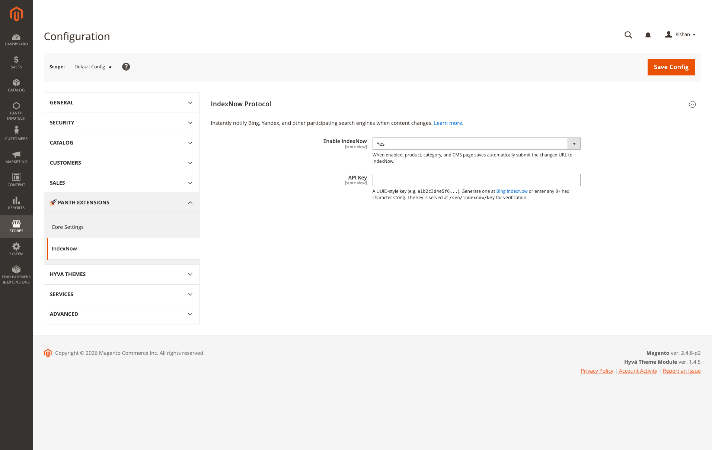

<!-- SEO Meta -->
<!--
  Title: Panth IndexNow - Instant Bing & Yandex Submission for Magento 2 | Panth Infotech
  Description: Panth IndexNow auto-submits changed URLs from Magento 2 (products, categories, CMS pages) to Bing, Yandex, Seznam, Naver and Yep via the IndexNow protocol. Real-time indexing, zero-config batching, per-store API keys, Hyva and Luma compatible. Magento 2.4.4 - 2.4.8, PHP 8.1 - 8.4.
  Keywords: magento 2 indexnow, magento 2 bing indexing, magento 2 yandex submission, magento 2 instant indexing, magento 2 seo, magento 2 bing webmaster, magento 2 url submission, magento 2 search engine ping, hyva indexnow, luma indexnow
  Author: Kishan Savaliya (Panth Infotech)
  Canonical: https://github.com/mage2sk/module-index-now
-->

# Panth IndexNow — Instant Bing & Yandex Submission for Magento 2 | Panth Infotech

[](https://magento.com)
[](https://php.net)
[](https://www.hyva.io)
[](https://packagist.org/packages/mage2kishan/module-index-now)
[](https://github.com/mage2sk/module-index-now)
[](https://www.upwork.com/freelancers/~016dd1767321100e21)
[](https://www.upwork.com/agencies/1881421506131960778/)
[](https://kishansavaliya.com)

> **Instantly notify Bing, Yandex, Seznam, Naver and Yep whenever a product, category, or CMS page changes** — via the open IndexNow protocol, with one plug-and-play Magento 2 module. Zero cron jobs, zero queues, zero clicking "submit URL" in Bing Webmaster Tools for every edit.

**Panth IndexNow** implements the [IndexNow protocol](https://www.indexnow.org/) inside Magento 2. When a merchant saves a product, category, or CMS page in admin, the module collects the changed URL and fires a single batched POST to `api.indexnow.org` at the end of the request — covering Bing, Yandex, Seznam, Naver and Yep in one call. Serves the required key-verification endpoint at `/panth_indexnow/key`, respects Magento URL rewrites and CMS URL suffixes, supports per-store API keys, and works identically on **Hyva** and **Luma** storefronts.

---

## 🚀 Need Custom Magento 2 Development?

> **Get a free quote for your project in 24 hours** — custom modules, Hyva themes, performance optimization, M1→M2 migrations, and Adobe Commerce Cloud.

<p align="center">
  <a href="https://kishansavaliya.com/get-quote">
    
  </a>
</p>

<table>
<tr>
<td width="50%" align="center">

### 🏆 Kishan Savaliya
**Top Rated Plus on Upwork**

[](https://www.upwork.com/freelancers/~016dd1767321100e21)

100% Job Success • 10+ Years Magento Experience
Adobe Certified • Hyva Specialist

</td>
<td width="50%" align="center">

### 🏢 Panth Infotech Agency
**Magento Development Team**

[](https://www.upwork.com/agencies/1881421506131960778/)

Custom Modules • Theme Design • Migrations
Performance • SEO • Adobe Commerce Cloud

</td>
</tr>
</table>

**Visit our website:** [kishansavaliya.com](https://kishansavaliya.com) &nbsp;|&nbsp; **Get a quote:** [kishansavaliya.com/get-quote](https://kishansavaliya.com/get-quote)

---

## Table of Contents

- [Key Features](#key-features)
- [What is IndexNow?](#what-is-indexnow)
- [Which Search Engines Does It Cover?](#which-search-engines-does-it-cover)
- [Screenshot](#screenshot)
- [Compatibility](#compatibility)
- [Installation](#installation)
- [Configuration](#configuration)
- [How It Works — Under the Hood](#how-it-works--under-the-hood)
- [What Triggers a Submission?](#what-triggers-a-submission)
- [The Key Verification Endpoint](#the-key-verification-endpoint)
- [Multi-Store Support](#multi-store-support)
- [Troubleshooting](#troubleshooting)
- [FAQ](#faq)
- [Support](#support)
- [About Panth Infotech](#about-panth-infotech)
- [Quick Links](#quick-links)

---

## Key Features

### Automatic URL Submission

- **Product saves** auto-submit the product URL to IndexNow the moment an admin clicks Save
- **Category saves** auto-submit the category listing URL
- **CMS page saves** auto-submit the rewritten canonical CMS URL (respects custom URL rewrites + configured suffix)
- **Single request batching** — multiple entity saves in one admin action fire one batched POST, not one per entity
- **End-of-request flush** via `register_shutdown_function` — observer stays out of the critical path, merchant's save button returns instantly

### Per-Store API Keys

- **Scope-aware** — configure one key per website or store view
- **Correct host in every payload** — each store's submission uses its own `host`, `key`, and `keyLocation`
- **Single default key works too** — set it once at Default Config and every store inherits

### Built-in Key Verification Endpoint

- **`/panth_indexnow/key`** — IndexNow's required verification URL, served as plain text from the admin-configured key
- **Optional `?key=<value>` query param** — lets crawlers pre-validate with timing-safe comparison; mismatches return 404 so the endpoint can't be abused as an arbitrary text echo service
- **Auto-404 when disabled** — if the feature flag is off or the key is empty, the endpoint returns a clean 404
- **Module-owned frontName** — uses `panth_indexnow` as its route's frontName so the module never shares a route registration with other modules (no controller resolution races)

### Safe Defaults

- **Disabled by default** — must be explicitly enabled in admin so a fresh install doesn't start submitting URLs until you're ready
- **ACL-gated** (`Panth_IndexNow::config`) — only roles with the permission can see / save the settings
- **Per-store toggle** — enable globally and disable on specific store views (or vice versa)

### Defensive HTTP Client

- **15-second timeout** — won't hang the admin request if IndexNow is slow
- **Full error logging** — HTTP status + response body logged to `var/log/system.log` for post-mortem
- **Never re-throws** — a failed submission never crashes the entity save that triggered it

---

## What is IndexNow?

[IndexNow](https://www.indexnow.org/) is an open protocol co-created by **Microsoft** and **Yandex** that lets websites notify search engines the moment their content changes — rather than waiting for the next crawl. A website POSTs a list of changed URLs to a shared endpoint, and every participating search engine receives the notification simultaneously.

Key benefits for eCommerce stores:

1. **Faster indexing** — new products and category changes appear in search results within minutes instead of days
2. **Lower crawl load** — search engines don't need to re-crawl your sitemap to discover changes
3. **One POST, many engines** — submitting to `api.indexnow.org` fanouts to Bing, Yandex, Seznam, Naver and Yep in a single request
4. **Bi-directional trust** — the `keyLocation` URL on your site proves ownership, so only you can submit URLs for your domain

The module handles the entire flow automatically — key hosting, URL collection, batching, submission, and error logging.

---

## Which Search Engines Does It Cover?

IndexNow has a defined list of participating search engines. Submission via `api.indexnow.org` is fanned out to all of them:

| Search Engine | IndexNow Support |
|---|---|
| **Bing** | ✅ Yes |
| **Yandex** | ✅ Yes |
| **Seznam** | ✅ Yes |
| **Naver** | ✅ Yes |
| **Yep** | ✅ Yes |
| **DuckDuckGo** | ➖ Indirect (uses Bing's index) |
| **Google** | ❌ No — Google does not participate in IndexNow |
| **Baidu** | ❌ No |

> **Note on Google:** Google has its own crawl schedule and doesn't accept IndexNow submissions. To speed up Google indexing, pair this module with an XML sitemap (e.g. `mage2kishan/module-xml-sitemap`) and use Google Search Console. This module is for Bing / Yandex / Seznam / Naver / Yep — the search engines that actually honor IndexNow.

---

## Screenshot

### Admin Configuration — Stores → Configuration → Panth Extensions → IndexNow



*Two settings, both at store-view scope: the master enable toggle and the API key. The inline comments link directly to Bing's IndexNow key generator and remind the merchant where the verification file is served.*

---

## Compatibility

| Requirement | Versions Supported |
|---|---|
| Magento Open Source | 2.4.4, 2.4.5, 2.4.6, 2.4.7, 2.4.8 |
| Adobe Commerce | 2.4.4, 2.4.5, 2.4.6, 2.4.7, 2.4.8 |
| Adobe Commerce Cloud | 2.4.4 — 2.4.8 |
| PHP | 8.1.x, 8.2.x, 8.3.x, 8.4.x |
| MySQL | 8.0+ |
| MariaDB | 10.4+ |
| Hyva Theme | 1.0+ (native support) |
| Luma Theme | Native support |
| Required Dependency | `mage2kishan/module-core` ^1.0 |

---

## Installation

### Composer Installation (Recommended)

```bash
composer require mage2kishan/module-index-now
bin/magento module:enable Panth_Core Panth_IndexNow
bin/magento setup:upgrade
bin/magento setup:di:compile
bin/magento setup:static-content:deploy -f
bin/magento cache:flush
```

### Manual Installation via ZIP

1. Download the latest release ZIP from [Packagist](https://packagist.org/packages/mage2kishan/module-index-now) or the [Adobe Commerce Marketplace](https://commercemarketplace.adobe.com)
2. Extract the contents to `app/code/Panth/IndexNow/` in your Magento installation
3. Ensure `Panth_Core` is installed (required dependency)
4. Run the same commands as above starting from `bin/magento module:enable`

### Verify Installation

```bash
bin/magento module:status Panth_IndexNow
# Expected output: Module is enabled
```

### Get an IndexNow API Key

1. Visit [Bing IndexNow](https://www.bing.com/indexnow) or [Yandex IndexNow](https://yandex.com/support/webmaster/indexnow.html)
2. Generate a UUID-style key (e.g. `a1b2c3d4e5f6a7b8c9d0e1f2a3b4c5d6`) — or invent any 8+ character hex string; IndexNow generates new keys per-site
3. Paste the key into Magento admin → Stores → Configuration → Panth Extensions → IndexNow → API Key
4. Save and flush the cache — submissions begin on the next catalog / CMS save

---

## Configuration

Navigate to **Admin → Stores → Configuration → Panth Extensions → IndexNow** to configure the module.

| Setting | Default | Scope | Description |
|---|---|---|---|
| Enable IndexNow | No | Store View | Master toggle. When on, product / category / CMS page saves submit the changed URL to IndexNow. |
| API Key | (empty) | Store View | A UUID-style key (e.g. `a1b2c3d4e5f6…`). The key is served at `/panth_indexnow/key` for verification. Must be at least 8 hex characters. |

Both settings are scope-aware — configure one key globally or set different keys per store view if you manage multiple brand domains from one Magento install.

---

## How It Works — Under the Hood

The module is deliberately small (three classes — an observer, a submitter, and a controller) and leans on Magento's native event system rather than inventing a scheduler:

```
 ┌────────────────────┐     save_after event     ┌─────────────────────┐
 │ Admin saves a      │ ─────────────────────▶   │ EntityChangeObserver│
 │ product / category │                          │                     │
 │ / CMS page         │                          │ - resolves URL      │
 └────────────────────┘                          │ - collects in batch │
                                                  │ - registers flush   │
                                                  └──────────┬──────────┘
                                                             │
                                                             │ PHP shutdown
                                                             ▼
                                                  ┌─────────────────────┐
                                                  │ Submitter           │
                                                  │                     │
                                                  │ POST api.indexnow.  │
                                                  │  org/IndexNow       │
                                                  │                     │
                                                  │ {                   │
                                                  │   host, key,        │
                                                  │   keyLocation,      │
                                                  │   urlList[]         │
                                                  │ }                   │
                                                  └──────────┬──────────┘
                                                             │
                                                             ▼
                                                    Bing, Yandex, Seznam,
                                                       Naver, Yep
```

**Design decisions:**

- **End-of-request flush** — the observer doesn't POST on every save; it accumulates URLs per-store in a static array and fires one batched request in `register_shutdown_function`. A merchant saving 5 product edits in one admin action gets 1 POST, not 5.
- **Store-scoped batching** — multi-store saves to different stores fire one POST per store (each with its own key + host), batched by store.
- **No database writes** — no queue table, no pending table. State lives only in the PHP request that triggered it. If PHP-FPM dies mid-request the batch is lost, but that's an acceptable trade-off for zero-infrastructure operation.
- **Never blocks** — the save button returns the moment the entity is written. The IndexNow POST happens after Magento has already sent the response.

---

## What Triggers a Submission?

| Event | Observer Fires | URL Submitted |
|---|---|---|
| `catalog_product_save_after` | ✅ | Product URL via `$product->getProductUrl()` (respects store rewrites) |
| `catalog_category_save_after` | ✅ | Category URL via `$category->getUrl()` |
| `cms_page_save_after` | ✅ | CMS page URL via `\Magento\Cms\Helper\Page::getPageUrl()` inside store emulation (respects URL rewrites + suffix) |
| `catalog_product_delete_after` | ➖ | Not subscribed — IndexNow has no "remove" semantic; search engines detect 404s via normal re-crawl |
| `catalog_category_delete_after` | ➖ | Not subscribed — same reason |
| `cms_page_delete_after` | ➖ | Not subscribed — same reason |
| Catalog rule save | ➖ | Not subscribed (product URLs don't change from a rule save) |
| Stock qty change | ➖ | Not subscribed |

---

## The Key Verification Endpoint

IndexNow requires the domain being submitted to serve the API key as a plain-text file at a declared URL. The module serves this automatically at:

```
https://yourstore.com/panth_indexnow/key
```

Accepted URL forms:

| URL | Behavior |
|---|---|
| `/panth_indexnow/key` | Returns the configured key as `text/plain` (HTTP 200) |
| `/panth_indexnow/key?key=<correct>` | Returns the key when the query matches (timing-safe compare) |
| `/panth_indexnow/key?key=<wrong>` | Returns 404 (prevents use as arbitrary text echo service) |
| `/panth_indexnow/key` when IndexNow disabled | Returns 404 |
| `/panth_indexnow/key` when API key empty | Returns 404 |

The key comparison is **timing-safe** via `hash_equals` — the endpoint resists timing-attack key discovery.

---

## Multi-Store Support

The module is fully scope-aware:

- **Default key** — set once at Default Config, inherited by every store
- **Per-website key** — set at Website scope for brand-specific keys
- **Per-store key** — set at Store View scope for the most granular setup

Each submission uses the correct key + host + keyLocation for the store the entity belongs to. Saving a product assigned to Store A and a CMS page assigned to Store B in one admin action triggers **two** POSTs — one per store — each with that store's own key.

```
Hyva store  → POST {host: hyva.test,  key: hyva-key-...,  keyLocation: https://hyva.test/panth_indexnow/key}
Luma store  → POST {host: luma.test,  key: luma-key-...,  keyLocation: https://luma.test/panth_indexnow/key}
```

---

## Troubleshooting

| Issue | Cause | Resolution |
|---|---|---|
| Nothing gets submitted after saving | Module not enabled at store scope | Enable in admin at the specific store view (not just default) |
| `/panth_indexnow/key` returns 404 | Feature disabled or key empty | Enable + set API key + flush cache |
| IndexNow API returns 422 | Your site's host isn't publicly reachable | Expected on dev/staging (`.test`, `.local`). Will work on production domains. |
| IndexNow API returns 403 | Key file doesn't match submitted key | Verify `/panth_indexnow/key` returns the same value as the admin API Key field |
| Submissions happen but search results don't update | Google doesn't honor IndexNow | Use XML sitemap + Search Console for Google. IndexNow covers Bing / Yandex only. |
| Batch size > 10,000 URLs | Observer batches in chunks of 10K automatically | No action needed — the spec maximum is handled by `array_chunk` |
| Admin role doesn't see the config section | ACL resource not granted | System → Permissions → User Roles → edit the role → grant Panth Extensions → IndexNow |
| Log says "unexpected HTTP status: 0" | Curl failure (timeout, DNS, firewall) | Check that `api.indexnow.org` is reachable from your Magento server |

---

## FAQ

### Does this submit URLs to Google?

No. Google does not participate in IndexNow and has stated they maintain their own crawl schedule. For Google indexing, use a proper XML sitemap and Google Search Console. This module is specifically for the IndexNow ecosystem (Bing, Yandex, Seznam, Naver, Yep).

### Do I need separate keys for Bing, Yandex, Seznam, and Naver?

No — that's the point of IndexNow. One key, submitted to `api.indexnow.org`, fans out to every participating engine. Generate the key once at [Bing IndexNow](https://www.bing.com/indexnow) or [Yandex IndexNow](https://yandex.com/support/webmaster/indexnow.html) and paste it into Magento.

### Where is the key file served?

`https://yourstore.com/panth_indexnow/key` — IndexNow crawlers hit this URL to verify domain ownership before trusting submitted URLs.

### What happens if the IndexNow API is down?

The HTTP call times out after 15 seconds, the failure is logged to `var/log/system.log`, and the save that triggered it completes normally. No admin-facing error, no retry queue — the next save attempts a fresh submission.

### Will this slow down product saves?

No. The observer only enqueues URLs during save and fires the actual POST in `register_shutdown_function` — **after** Magento has already sent the response to the admin. The merchant's Save button returns at normal speed.

### Does it work with Hyva?

Yes. IndexNow operates at the backend event layer (`catalog_product_save_after`, etc.) — it's theme-agnostic. Runs identically on Hyva, Luma, or any Magento 2 theme.

### Can I submit a sitemap URL manually?

IndexNow is per-URL, not per-sitemap — Bing already polls your sitemap separately. If you want to force a re-crawl of a specific URL (not triggered by a save), you'd need a custom CLI command; this module doesn't ship one in v1.0.

### Is Panth_Core required?

Yes. `mage2kishan/module-core` is a required dependency and is pulled in automatically by Composer. Core provides the admin tab layout and common utilities.

### Does it support multi-store / multi-language?

Yes. Every configuration setting respects Magento's standard scope hierarchy (default → website → store view). Set different keys per store view, per website, or one default key globally — whichever fits your setup.

### What about product / category / CMS page deletions?

Not submitted. IndexNow is designed for **new or changed** content. Deletions are detected by search engines through normal re-crawl when they hit a 404 on the next visit to the URL.

### Will this hit rate limits?

IndexNow allows up to 10,000 URLs per POST. The module batches automatically via `array_chunk`, so a burst of 15,000 saves produces two POSTs (10K + 5K). You're extremely unlikely to hit IndexNow's per-day limits from a normal eCommerce catalog.

---

## Support

| Channel | Contact |
|---|---|
| Email | kishansavaliyakb@gmail.com |
| Website | [kishansavaliya.com](https://kishansavaliya.com) |
| WhatsApp | +91 84012 70422 |
| GitHub Issues | [github.com/mage2sk/module-index-now/issues](https://github.com/mage2sk/module-index-now/issues) |
| Upwork (Top Rated Plus) | [Hire Kishan Savaliya](https://www.upwork.com/freelancers/~016dd1767321100e21) |
| Upwork Agency | [Panth Infotech](https://www.upwork.com/agencies/1881421506131960778/) |

Response time: 1-2 business days.

### 💼 Need Custom Magento Development?

Looking for **custom Magento module development**, **Hyva theme customization**, **store migrations**, or **performance optimization**? Get a free quote in 24 hours:

<p align="center">
  <a href="https://kishansavaliya.com/get-quote">
    
  </a>
</p>

<p align="center">
  <a href="https://www.upwork.com/freelancers/~016dd1767321100e21">
    
  </a>
  &nbsp;&nbsp;
  <a href="https://www.upwork.com/agencies/1881421506131960778/">
    
  </a>
  &nbsp;&nbsp;
  <a href="https://kishansavaliya.com">
    
  </a>
</p>

**Specializations:**

- 🛒 **Magento 2 Module Development** — custom extensions following MEQP standards
- 🎨 **Hyva Theme Development** — Alpine.js + Tailwind CSS, lightning-fast storefronts
- 🖌️ **Luma Theme Customization** — pixel-perfect designs, responsive layouts
- ⚡ **Performance Optimization** — Core Web Vitals, page speed, caching strategies
- 🔍 **Magento SEO** — structured data, hreflang, sitemaps, AI-generated meta
- 🛍️ **Checkout Optimization** — one-page checkout, conversion rate optimization
- 🚀 **M1 to M2 Migrations** — data migration, custom feature porting
- ☁️ **Adobe Commerce Cloud** — deployment, CI/CD, performance tuning
- 🔌 **Third-party Integrations** — payment gateways, ERP, CRM, marketing tools

---

## License

Panth IndexNow is licensed under a proprietary license — see `LICENSE.txt`. One license per Magento installation.

---

## About Panth Infotech

Built and maintained by **Kishan Savaliya** — [kishansavaliya.com](https://kishansavaliya.com) — a **Top Rated Plus** Magento developer on Upwork with 10+ years of eCommerce experience.

**Panth Infotech** is a Magento 2 development agency specializing in high-quality, security-focused extensions and themes for both Hyva and Luma storefronts. Our extension suite covers SEO, performance, checkout, product presentation, customer engagement, and store management — over 34 modules built to MEQP standards and tested across Magento 2.4.4 to 2.4.8.

Browse the full extension catalog on the [Adobe Commerce Marketplace](https://commercemarketplace.adobe.com) or [Packagist](https://packagist.org/packages/mage2kishan/).

### Quick Links

- 🌐 **Website:** [kishansavaliya.com](https://kishansavaliya.com)
- 💬 **Get a Quote:** [kishansavaliya.com/get-quote](https://kishansavaliya.com/get-quote)
- 👨‍💻 **Upwork Profile (Top Rated Plus):** [upwork.com/freelancers/~016dd1767321100e21](https://www.upwork.com/freelancers/~016dd1767321100e21)
- 🏢 **Upwork Agency:** [upwork.com/agencies/1881421506131960778](https://www.upwork.com/agencies/1881421506131960778/)
- 📦 **Packagist:** [packagist.org/packages/mage2kishan/module-index-now](https://packagist.org/packages/mage2kishan/module-index-now)
- 🐙 **GitHub:** [github.com/mage2sk/module-index-now](https://github.com/mage2sk/module-index-now)
- 🛒 **Adobe Marketplace:** [commercemarketplace.adobe.com](https://commercemarketplace.adobe.com)
- 📧 **Email:** kishansavaliyakb@gmail.com
- 📱 **WhatsApp:** +91 84012 70422

---

<p align="center">
  <strong>Ready to get your store indexed by Bing and Yandex in minutes, not days?</strong><br/>
  <a href="https://kishansavaliya.com/get-quote">
    
  </a>
</p>

---

**SEO Keywords:** magento 2 indexnow, magento 2 bing indexing, magento 2 yandex submission, magento 2 instant indexing, magento 2 search engine ping, magento 2 bing webmaster, magento 2 url submission, magento 2 seo extension, magento 2 seznam indexing, magento 2 naver indexing, magento 2 yep search, magento 2 crawl optimization, magento 2 real-time seo, magento 2 product url submission, magento 2 category url submission, magento 2 cms page submission, hyva indexnow, hyva bing indexing, luma indexnow, luma bing submission, magento 2 seo automation, magento 2 webmaster tools, magento 2 api indexing, magento 2 search console automation, magento 2.4.8 indexnow, magento 2 PHP 8.4 indexnow, mage2kishan indexnow, panth infotech indexnow, kishan savaliya magento, hire magento developer upwork, top rated plus magento freelancer, custom magento development, adobe commerce indexnow, magento 2 bing key, magento 2 yandex key, magento 2 indexnow protocol, magento 2 multi-store indexnow, magento 2 url batching, magento 2 indexnow plugin, magento 2 search engine notification
