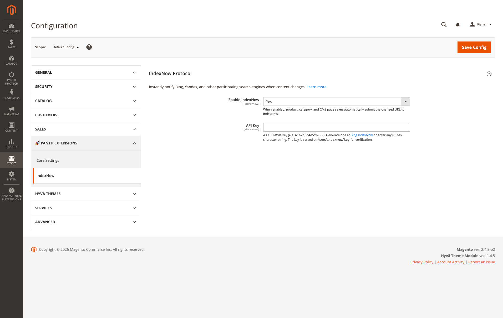

<!-- SEO Meta -->
<!--
  Title: Magento 2 IndexNow Extension: Instant Bing, Yandex & Search Engine URL Submission | Panth Infotech
  Description: Panth IndexNow auto-submits changed product, category, and CMS page URLs from Magento 2 to Bing, Yandex, Seznam, Naver, and Yep via the IndexNow protocol. Per-store API keys, batched submission, built-in key endpoint. Works on Magento 2.4.4 to 2.4.8 and PHP 8.1 to 8.4.
  Keywords: magento 2 indexnow, magento 2 bing indexing, magento 2 yandex submission, magento 2 instant indexing, magento 2 seo extension, magento 2 url submission, magento 2 search engine ping, hyva indexnow, luma indexnow, magento 2 bing webmaster, magento 2 indexnow extension
  Author: Kishan Savaliya (Panth Infotech)
  Canonical: https://kishansavaliya.com/magento-2-index-now.html
-->

# Magento 2 IndexNow Extension: Instant Bing, Yandex and Search Engine URL Submission (Hyva + Luma)

[](https://magento.com)
[](https://php.net)
[](https://www.hyva.io)
[](https://kishansavaliya.com/magento-2-index-now.html)
[](https://packagist.org/packages/mage2kishan/module-index-now)
[](https://www.upwork.com/freelancers/~016dd1767321100e21)
[](https://kishansavaliya.com)

> **Tell Bing, Yandex, Seznam, Naver, and Yep about a page change the moment it happens.** Panth IndexNow hooks into Magento's product, category, and CMS page save events, batches the changed URLs, and fires one POST to `api.indexnow.org` after the admin response is already sent. No cron jobs. No queue tables. No manual URL submission.

**Product page:** [kishansavaliya.com/magento-2-index-now.html](https://kishansavaliya.com/magento-2-index-now.html)

---

## Quick Answer

**What is Panth IndexNow?** It is a Magento 2 extension that implements the IndexNow protocol. When you save a product, category, or CMS page, the module automatically sends the updated URL to every IndexNow-participating search engine in a single batched request.

**What does it add to my store?**

- **Automatic URL submission** for products, categories, and CMS pages whenever they are saved in admin.
- **Single batched POST** to `api.indexnow.org` covering Bing, Yandex, Seznam, Naver, and Yep in one call.
- **Built-in key verification endpoint** at `/panth_indexnow/key` so search engines can confirm domain ownership.
- **Per-store API keys** so you can run different keys across brand or language store views.

**Which themes are supported?** Both **Hyva** and **Luma** (and any other Magento 2 theme). IndexNow runs entirely on the backend event layer and is theme-agnostic.

**What does it need?** Magento 2.4.4 to 2.4.8, PHP 8.1 to 8.4, and the free `mage2kishan/module-core` package.

**Does it cover Google?** No. Google does not participate in IndexNow. For Google, use an XML sitemap and Google Search Console. This module is for the IndexNow ecosystem only.

---

## Need Custom Magento 2 Development?

> **Get a free quote for your project in 24 hours** for custom modules, Hyva themes, performance work, M1 to M2 migrations, and Adobe Commerce Cloud.

<p align="center">
  <a href="https://kishansavaliya.com/get-quote">
    
  </a>
</p>

<table>
<tr>
<td width="50%" align="center">

### Kishan Savaliya
**Top Rated Plus on Upwork**

[](https://www.upwork.com/freelancers/~016dd1767321100e21)

100% Job Success • 10+ Years Magento Experience
Adobe Certified • Hyva Specialist

</td>
<td width="50%" align="center">

### Panth Infotech Agency
**Magento Development Team**

[](https://www.upwork.com/agencies/1881421506131960778/)

Custom Modules • Theme Design • Migrations
Performance • SEO • Adobe Commerce Cloud

</td>
</tr>
</table>

**Visit our website:** [kishansavaliya.com](https://kishansavaliya.com) &nbsp;|&nbsp; **Get a quote:** [kishansavaliya.com/get-quote](https://kishansavaliya.com/get-quote)

---

## Table of Contents

- [Who Is It For](#who-is-it-for)
- [Key Features](#key-features)
- [What is IndexNow](#what-is-indexnow)
- [Which Search Engines Does It Cover](#which-search-engines-does-it-cover)
- [Screenshot](#screenshot)
- [Compatibility](#compatibility)
- [Installation](#installation)
- [Configuration](#configuration)
- [How It Works](#how-it-works)
- [The Key Verification Endpoint](#the-key-verification-endpoint)
- [Multi-Store Support](#multi-store-support)
- [FAQ](#faq)
- [Support](#support)
- [About Panth Infotech](#about-panth-infotech)
- [Quick Links](#quick-links)

---

## Who Is It For

- **Merchants with active catalogs** who add or update products often and want Bing and Yandex to pick up changes within minutes instead of waiting for the next scheduled crawl.
- **Stores in regions where Bing, Yandex, or Seznam drive real traffic**, such as the US, Russia, Eastern Europe, or South Korea.
- **Hyva storefronts** that want an IndexNow integration with no JavaScript overhead, since the module works entirely at the PHP event layer.
- **Multi-brand or multi-language setups** that need a separate IndexNow API key per store view.
- **Developers and agencies** who want a plug-and-play IndexNow solution with no queue tables, no extra infra, and clean MEQP-compliant code.

---

## Key Features

### Automatic URL Submission

- **Product saves** fire a URL submission to IndexNow the moment an admin clicks Save.
- **Category saves** submit the category listing URL.
- **CMS page saves** submit the correct canonical URL, respecting custom URL rewrites and the configured suffix.
- **Batched POST** - multiple entity saves in one admin action produce one POST, not one per entity.
- **End-of-request flush** via `register_shutdown_function`, so the merchant's Save button returns at normal speed. The IndexNow call happens after Magento has already sent the admin response.

### Per-Store API Keys

- **Scope-aware config** - configure one key at Default Config and every store inherits it, or set different keys per website or store view.
- **Correct host in every payload** - each store's submission uses its own `host`, `key`, and `keyLocation` values.
- **Multi-store batching** - saving entities across two store views in one action fires one POST per store, each with that store's own key.

### Built-in Key Verification Endpoint

- **`/panth_indexnow/key`** serves the configured API key as plain text, which IndexNow requires to confirm domain ownership.
- **Optional `?key=value` query param** - if present, must match the configured key with a timing-safe comparison; mismatches return 404.
- **Auto-404 when disabled** - returns 404 when the module is off or the key is empty.
- **Owns its own route** - uses `panth_indexnow` as the frontName so the endpoint never collides with another module's routes.

### Defensive HTTP Client

- **15-second timeout** - won't stall the admin request if the IndexNow API is slow.
- **Full error logging** - HTTP status and response body are written to `var/log/system.log` on failure.
- **Never re-throws** - a failed submission never crashes the entity save that caused it.
- **10,000 URL batch cap** - the IndexNow spec limit is handled automatically via `array_chunk`.

### Safe Defaults

- **Disabled by default** - a fresh install does not submit anything until you explicitly enable it and enter a key.
- **ACL-gated** (`Panth_IndexNow::config`) - only admin roles with the permission can see or save the settings.

---

## What is IndexNow

[IndexNow](https://www.indexnow.org/) is an open protocol started by Microsoft and Yandex. It lets any website tell participating search engines about content changes the moment they happen, instead of waiting for the next crawl cycle.

The site sends a POST with a list of changed URLs to `api.indexnow.org`. Every participating engine receives the notification from that single request. A key file hosted on the domain proves ownership so only the site itself can submit URLs for its host.

Key benefits for eCommerce stores:

- **Faster indexing** - updated products and categories can appear in Bing and Yandex within minutes.
- **Lower crawl load** - engines spend fewer resources re-crawling an unchanged sitemap.
- **One POST, many engines** - `api.indexnow.org` fans out to Bing, Yandex, Seznam, Naver, and Yep in one call.

---

## Which Search Engines Does It Cover

Submitting to `api.indexnow.org` notifies all participating engines:

| Search Engine | IndexNow Support |
|---|---|
| **Bing** | Yes |
| **Yandex** | Yes |
| **Seznam** | Yes |
| **Naver** | Yes |
| **Yep** | Yes |
| **DuckDuckGo** | Indirect (uses Bing's index) |
| **Google** | No - Google does not participate in IndexNow |
| **Baidu** | No |

For Google indexing, use an XML sitemap (e.g. `mage2kishan/module-xml-sitemap`) and Google Search Console. This module covers Bing, Yandex, Seznam, Naver, and Yep only.

---

## Screenshot

### Admin Configuration - Stores - Configuration - Panth Extensions - IndexNow



*Two settings at store-view scope: the master enable toggle and the API key. The inline comment links to Bing's IndexNow key generator and shows where the verification file is served.*

---

## Compatibility

| Requirement | Versions Supported |
|---|---|
| Magento Open Source | 2.4.4, 2.4.5, 2.4.6, 2.4.7, 2.4.8 |
| Adobe Commerce | 2.4.4, 2.4.5, 2.4.6, 2.4.7, 2.4.8 |
| Adobe Commerce Cloud | 2.4.4 to 2.4.8 |
| PHP | 8.1.x, 8.2.x, 8.3.x, 8.4.x |
| MySQL | 8.0+ |
| MariaDB | 10.4+ |
| Hyva Theme | 1.0+ |
| Luma Theme | Native support |
| Required Dependency | `mage2kishan/module-core` (free) |

---

## Installation

### Composer Installation (Recommended)

```bash
composer require mage2kishan/module-index-now
bin/magento module:enable Panth_Core Panth_IndexNow
bin/magento setup:upgrade
bin/magento setup:di:compile
bin/magento setup:static-content:deploy -f
bin/magento cache:flush
```

### Manual Installation via ZIP

1. Download the latest release from [Packagist](https://packagist.org/packages/mage2kishan/module-index-now) or from the [product page](https://kishansavaliya.com/magento-2-index-now.html).
2. Extract the contents to `app/code/Panth/IndexNow/` in your Magento installation.
3. Make sure `Panth_Core` is installed (required dependency).
4. Run the commands above starting from `bin/magento module:enable`.

### Verify Installation

```bash
bin/magento module:status Panth_IndexNow
# Expected: Module is enabled
```

### Get an IndexNow API Key

1. Go to [Bing IndexNow](https://www.bing.com/indexnow) or [Yandex IndexNow](https://yandex.com/support/webmaster/indexnow.html).
2. Generate or copy a UUID-style key (any 8+ hex character string works).
3. Paste the key in **Stores - Configuration - Panth Extensions - IndexNow - API Key**.
4. Save and flush the cache. Submissions start on the next product, category, or CMS page save.

---

## Configuration

Go to **Stores - Configuration - Panth Extensions - IndexNow**.

| Setting | Group | Default | Description |
|---|---|---|---|
| Enable IndexNow | IndexNow Protocol | No | Master toggle. When on, product, category, and CMS page saves automatically submit the changed URL to IndexNow. |
| API Key | IndexNow Protocol | (empty) | A UUID-style key (e.g. `a1b2c3d4e5f6...`). The key is served at `/panth_indexnow/key` for verification. Must be at least 8 hex characters. |

Both settings are store-view scoped. Set one default key globally, or different keys per website or store view for multi-brand setups.

---

## How It Works

The module uses three classes: an observer, a submitter, and a controller.

1. Admin saves a product, category, or CMS page.
2. The `EntityChangeObserver` fires on the matching `save_after` event, resolves the canonical URL for that store, and adds it to an in-memory batch.
3. On the first URL collected, a `register_shutdown_function` callback is registered. This runs after Magento has already sent the admin response, so the merchant's Save button returns at normal speed.
4. At PHP shutdown, the submitter sends one batched POST per store view to `api.indexnow.org`, including the `host`, `key`, `keyLocation`, and `urlList` fields required by the IndexNow spec.
5. Bing, Yandex, Seznam, Naver, and Yep all receive the notification from that single POST.
6. Any HTTP or connection error is logged to `var/log/system.log`. The original save is never affected.

**What triggers a submission:**

| Event | URL Submitted |
|---|---|
| `catalog_product_save_after` | Product URL via `$product->getProductUrl()` |
| `catalog_category_save_after` | Category URL via `$category->getUrl()` |
| `cms_page_save_after` | CMS page URL with URL rewrites and suffix applied |

Deletes are not submitted. IndexNow has no "remove" instruction - search engines find 404s on their next crawl.

---

## The Key Verification Endpoint

IndexNow requires that the domain being submitted serves the API key as plain text at a declared URL. The module handles this automatically:

```
https://yourstore.com/panth_indexnow/key
```

| URL Form | Behavior |
|---|---|
| `/panth_indexnow/key` | Returns the configured key as `text/plain` (HTTP 200) |
| `/panth_indexnow/key?key=correct` | Returns the key when the query param matches (timing-safe compare) |
| `/panth_indexnow/key?key=wrong` | Returns 404 |
| `/panth_indexnow/key` when IndexNow is disabled | Returns 404 |
| `/panth_indexnow/key` when API key is empty | Returns 404 |

The comparison uses `hash_equals` to prevent timing-attack key discovery.

---

## Multi-Store Support

Every configuration setting respects Magento's standard scope hierarchy:

- **Default key** - set once, inherited by every website and store view.
- **Per-website key** - override at website scope for brand-specific keys.
- **Per-store key** - most granular; useful when one Magento install powers multiple independent brand domains.

When a single admin action saves entities belonging to two different stores, the module fires one POST per store, each carrying that store's own key and host:

```
Store A  ->  POST { host: storea.com,  key: key-a,  keyLocation: https://storea.com/panth_indexnow/key }
Store B  ->  POST { host: storeb.com,  key: key-b,  keyLocation: https://storeb.com/panth_indexnow/key }
```

---

## FAQ

### Does this submit URLs to Google?

No. Google does not participate in IndexNow. For Google, use an XML sitemap and Google Search Console. This module covers Bing, Yandex, Seznam, Naver, and Yep only.

### Do I need separate keys for Bing, Yandex, and the other engines?

No. One key submitted to `api.indexnow.org` fans out to every participating engine. Generate the key once at [Bing IndexNow](https://www.bing.com/indexnow) and paste it into Magento.

### Where is the key file served?

At `https://yourstore.com/panth_indexnow/key`. IndexNow crawlers fetch this URL to verify domain ownership before trusting submitted URLs. The module serves it automatically from the admin-configured key.

### Will product saves slow down?

No. The observer only queues URLs during the save. The actual POST to IndexNow runs in `register_shutdown_function`, after Magento has already sent the admin response. The Save button returns at normal speed.

### What happens if the IndexNow API is down or unreachable?

The HTTP call times out after 15 seconds. The failure is logged to `var/log/system.log`. The entity save completes normally. There is no retry queue - the next save starts a fresh attempt.

### Does it work with Hyva themes?

Yes. The module runs on the backend event layer (`catalog_product_save_after`, etc.) and has no frontend JavaScript. It works identically on Hyva, Luma, or any other Magento 2 theme.

### What about product or category deletions?

Deletions are not submitted. IndexNow is designed for new or changed content. When a product is deleted and the URL returns 404, search engines detect this on their next crawl without any notification needed.

### Can I use different keys for different stores in one Magento install?

Yes. The API Key setting is store-view scoped. Set a different key per store view, per website, or one global default - whichever fits your setup.

### Does Panth IndexNow need Panth Core?

Yes. `mage2kishan/module-core` is a free required dependency that Composer installs for you automatically.

---

## Support

| Channel | Contact |
|---|---|
| Product Page | [kishansavaliya.com/magento-2-index-now.html](https://kishansavaliya.com/magento-2-index-now.html) |
| Email | kishansavaliyakb@gmail.com |
| Website | [kishansavaliya.com](https://kishansavaliya.com) |
| WhatsApp | +91 84012 70422 |
| GitHub Issues | [github.com/mage2sk/module-index-now/issues](https://github.com/mage2sk/module-index-now/issues) |
| Upwork (Top Rated Plus) | [Hire Kishan Savaliya](https://www.upwork.com/freelancers/~016dd1767321100e21) |
| Upwork Agency | [Panth Infotech](https://www.upwork.com/agencies/1881421506131960778/) |

Response time: 1-2 business days.

### Need Custom Magento Development?

Looking for **custom Magento module development**, **Hyva theme work**, **store migrations**, or **performance tuning**? Get a free quote in 24 hours:

<p align="center">
  <a href="https://kishansavaliya.com/get-quote">
    
  </a>
</p>

<p align="center">
  <a href="https://www.upwork.com/freelancers/~016dd1767321100e21">
    
  </a>
  &nbsp;&nbsp;
  <a href="https://www.upwork.com/agencies/1881421506131960778/">
    
  </a>
  &nbsp;&nbsp;
  <a href="https://kishansavaliya.com/magento-2-index-now.html">
    
  </a>
</p>

---

## About Panth Infotech

Built and maintained by **Kishan Savaliya** ([kishansavaliya.com](https://kishansavaliya.com)), a **Top Rated Plus** Magento developer on Upwork with 10+ years of eCommerce experience.

**Panth Infotech** is a Magento 2 development agency that builds high quality, security focused extensions and themes for both Hyva and Luma storefronts. The extension suite covers SEO, performance, checkout, product presentation, customer engagement, and store management, with each module built to MEQP standards and tested across Magento 2.4.4 to 2.4.8.

Browse the full extension catalog on our [Magento extensions page](https://kishansavaliya.com/magento-extensions.html) or on [Packagist](https://packagist.org/packages/mage2kishan/).

---

## Quick Links

| Resource | Link |
|---|---|
| **Product Page** | [magento-2-index-now.html](https://kishansavaliya.com/magento-2-index-now.html) |
| **Packagist** | [mage2kishan/module-index-now](https://packagist.org/packages/mage2kishan/module-index-now) |
| **GitHub** | [mage2sk/module-index-now](https://github.com/mage2sk/module-index-now) |
| **Website** | [kishansavaliya.com](https://kishansavaliya.com) |
| **Free Quote** | [kishansavaliya.com/get-quote](https://kishansavaliya.com/get-quote) |
| **Upwork (Top Rated Plus)** | [Hire Kishan Savaliya](https://www.upwork.com/freelancers/~016dd1767321100e21) |
| **Upwork Agency** | [Panth Infotech](https://www.upwork.com/agencies/1881421506131960778/) |
| **Email** | kishansavaliyakb@gmail.com |
| **WhatsApp** | +91 84012 70422 |

---

<p align="center">
  <strong>Ready to get your store indexed by Bing and Yandex faster?</strong><br/>
  <a href="https://kishansavaliya.com/magento-2-index-now.html">
    
  </a>
</p>

---

**SEO Keywords:** magento 2 indexnow, magento 2 indexnow extension, magento 2 indexnow module, magento 2 bing indexing, magento 2 yandex submission, magento 2 instant indexing, magento 2 search engine ping, magento 2 url submission, magento 2 seo extension, magento 2 indexnow protocol, hyva indexnow, hyva bing indexing, luma indexnow, luma bing submission, magento 2 bing webmaster, magento 2 seznam indexing, magento 2 naver indexing, magento 2 yep search, magento 2 real-time seo, magento 2 product url submission, magento 2 category url submission, magento 2 cms page submission, magento 2 indexnow key endpoint, magento 2 multi-store indexnow, magento 2 url batching, magento 2 seo automation, magento 2 crawl optimization, magento 2.4.8 indexnow, php 8.4 indexnow, mage2kishan indexnow, panth indexnow, panth infotech, hire magento developer, top rated plus upwork, kishan savaliya magento, custom magento development, adobe commerce indexnow
