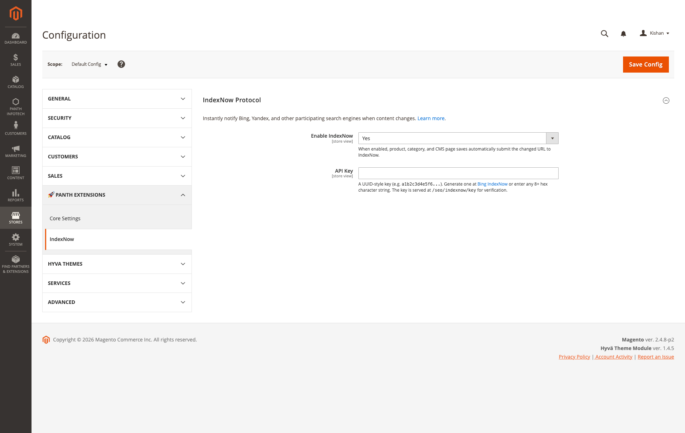

# Magento 2 IndexNow

Notifies search engines that support the IndexNow protocol (Bing, Yandex and the other participating engines) as soon as a product, category or CMS page is saved or deleted in the admin, so the changed URL is picked up without waiting for a crawl. The module submits the URLs to the shared IndexNow endpoint and serves the verification key file the protocol requires.

It is for store owners who want content changes reflected quickly in IndexNow-participating engines. Google does not use IndexNow; nothing is submitted there. The module has no storefront output, so it works with any theme.

Product page: [kishansavaliya.com/magento-2-index-now.html](https://kishansavaliya.com/magento-2-index-now.html)

## Features

- Submits the URL of a product, category or CMS page to IndexNow when it is saved or deleted in the admin.
- Changed URLs are stored in the `panth_index_now_queue` table and submitted either at the end of the save request (default, 4 second timeout) or by a cron job every minute, one request per store host and key, in batches of up to 10,000 URLs. URLs that could not be submitted are retried by cron up to 5 times.
- Serves the IndexNow key at `/<key>.txt` and at `/panth_indexnow/key` on the storefront (plain text, not cached), with a 404 when the module is disabled or the key is missing or invalid.
- API key and enable switch per store view, so each store view can use its own key.
- Failures are logged to Magento's log files and never interrupt the save.
- The key file response always carries `X-Robots-Tag: noindex, nofollow`, even when another extension rewrites robots headers on storefront responses.
- One database table (`panth_index_now_queue`) and one cron job (`panth_index_now_flush`); no console commands.

## Compatibility

| | |
|---|---|
| Magento Open Source / Adobe Commerce | 2.4.4 to 2.4.8 |
| PHP | 8.1, 8.2, 8.3, 8.4 |
| Themes | Any (no storefront output) |

The Composer package requires `magento/framework ^103.0`, `magento/module-store ^101.1`, `magento/module-catalog ^104.0`, `magento/module-cms ^104.0`, `magento/module-config ^101.2`, `magento/module-backend ^102.0` and `magento/module-cron ^100.4`.

## Requirements

- Magento 2.4.4 or later
- PHP 8.1 to 8.4
- `mage2kishan/module-core` (installed automatically by Composer; provides the shared "Panth Extensions" admin tab)
- Outbound HTTPS access from the web server to `api.indexnow.org`
- Magento cron running, if Submission Mode is set to "By cron" or failed submissions should be retried
- An IndexNow key: 8 to 128 characters, using only letters, digits and dashes. Bing offers a generator at [bing.com/indexnow](https://www.bing.com/indexnow); any string in that format works. Keys in any other format are rejected when the configuration is saved.

## Installation

```bash
composer require mage2kishan/module-index-now
bin/magento module:enable Panth_Core Panth_IndexNow
bin/magento setup:upgrade
bin/magento setup:di:compile
bin/magento cache:flush
```

`setup:di:compile` is only needed in production mode. The module has no static assets.

Check the result with:

```bash
bin/magento module:status Panth_IndexNow
```

The module is switched off by default. Enter a key and enable it in the configuration, then open `/<key>.txt` on your store's domain and confirm the key is returned.

## Configuration

Go to **Stores > Configuration > Panth Extensions > IndexNow**.

| Setting | Default | What it does |
|---|---|---|
| Enable IndexNow | No | Submits changed URLs on save and serves the key file. |
| API Key | (empty) | Your IndexNow key (8 to 128 letters, digits or dashes). Also used to answer the key file request. |
| Submit Deleted URLs | Yes | Submits the URL of a deleted product, category or CMS page so search engines recrawl it and drop it. Set to No to submit saves only, as in earlier versions. |
| Submission Mode | At the end of the request | "At the end of the request" submits the queued URLs when the save request finishes, with a 4 second request timeout and a 2 second connect timeout. "By cron" only stores the URLs during the save and lets the `panth_index_now_flush` cron job submit them every minute with a 15 second timeout. |

Enable IndexNow, API Key and Submit Deleted URLs can be set per default, website or store view; Submission Mode is a global (default scope) setting. Configuration paths: `panth_index_now/indexnow/enabled`, `panth_index_now/indexnow/api_key`, `panth_index_now/indexnow/submit_deletions`, `panth_index_now/indexnow/submission_mode`.



## Usage

- Saving a product, a category or a CMS page in the admin queues its storefront URL for the store view the entity was saved in. When it is saved at the default ("All Store Views") scope, the URL of every active store view the entity belongs to is queued. Only store views with IndexNow enabled are used.
- Deleting a product, a category or a CMS page queues its storefront URL for every active store view it belonged to, with the action `delete`. The URL is resolved in a `model_delete_before` observer, which runs before Magento removes the URL rewrites, so the SEO-friendly URL is submitted. Deleted URLs are submitted in the same batch as saved ones, as the IndexNow protocol expects; the search engine then finds the 404 and drops the page.
- Products that are not visible individually and root categories are skipped.
- Queued URLs are stored in `panth_index_now_queue` (one row per store view and URL; queuing the same URL again updates the row). In the default mode the rows queued by a request are submitted when that request ends; in cron mode the `panth_index_now_flush` job (every minute, `default` cron group) submits them. Submitted rows are deleted. When a submission fails, for example because the key is missing or the endpoint is unreachable, the row's attempt counter is increased and the cron job retries it (in the default mode only rows older than 2 minutes, so it does not race the request); after 5 failed attempts the row is removed and a warning is logged.
- The queued URLs are posted to the IndexNow endpoint at `api.indexnow.org/IndexNow` as JSON with the store host, the key, the key location and the URL list, one request per host and key. Only URLs on the store's own host and under its base URL are sent. IndexNow shares submissions with all participating engines, so one submission is enough.
- The key location sent is `<store base URL>/<key>.txt`, so every URL of the store falls under it as the protocol requires. The key file is also served at `/panth_indexnow/key`, which answers `/panth_indexnow/key?key=<key>` (a `.txt` suffix on the key is accepted) and returns the key only when it matches the configured one.
- Results are written to Magento's log: successful submissions as info entries, unexpected HTTP responses and connection errors as warnings or errors. Submissions made at the end of a save request use a 4 second request timeout and a 2 second connect timeout, so a slow endpoint delays the admin save by at most about 4 seconds; use cron mode to keep the save request free of any outbound call. Cron submissions use 15 and 5 seconds.
- The router that maps `/<key>.txt` hands the request to the standard router after the first match, so the key file is served instead of failing with a router loop.
- The key file response sets `X-Robots-Tag: noindex, nofollow`. A `beforeSendResponse` plugin on `Magento\Framework\App\Response\Http` (sort order 10000, frontend area) sets the header again for requests routed to `panth_indexnow/key`, after other plugins such as the Panth Robots SEO header plugin have run, so the key file keeps its own directive instead of the store-wide robots defaults.

## Developer Notes

- Module name: `Panth_IndexNow`
- Composer package: `mage2kishan/module-index-now`
- PHP namespace: `Panth\IndexNow`
- Observer `Panth\IndexNow\Observer\IndexNow\EntityChangeObserver` on `catalog_product_save_after`, `catalog_category_save_after`, `cms_page_save_after` and `model_delete_before` (products, categories and CMS pages only); URLs are queued through `Panth\IndexNow\Model\IndexNow\Queue::add(int $storeId, string $url, string $action)` and submitted by `Queue::flush()` through `Panth\IndexNow\Model\IndexNow\Submitter::submit(array $urls, int $storeId, int $timeout = 15)`.
- Cron job `panth_index_now_flush` (`Panth\IndexNow\Cron\FlushQueue`).
- Frontend route `panth_indexnow`, controller `Panth\IndexNow\Controller\Key\Index`; router `Panth\IndexNow\Controller\Router` maps `/<key>.txt` to it.
- Upgrade from Panth Advanced SEO: the data patch `MigrateConfigPaths` moves saved values from `panth_seo/indexnow/*` to `panth_index_now/indexnow/*` during `setup:upgrade`. A value that already exists at the new path for the same scope is kept, and the legacy row is left in place.
- ACL resource for the configuration section: `Panth_IndexNow::config`

## Uninstallation

```bash
bin/magento module:disable Panth_IndexNow
composer remove mage2kishan/module-index-now
bin/magento setup:upgrade
bin/magento setup:di:compile
bin/magento cache:flush
```

The `panth_index_now_queue` table is removed by `setup:upgrade` after the module is disabled and removed, as it is declared in `etc/db_schema.xml`. Configuration values remain in `core_config_data` until removed.

## Support

- Product page: [kishansavaliya.com/magento-2-index-now.html](https://kishansavaliya.com/magento-2-index-now.html)
- Contact: [kishansavaliya.com/contact](https://kishansavaliya.com/contact)
- Email: kishansavaliyakb@gmail.com
- Bug reports: [GitHub issues](https://github.com/mage2sk/module-index-now/issues)

## License

Proprietary, as declared in `composer.json`. The package is published on Packagist and can be installed with Composer; see the product page for the terms of use.

## Changelog

See [CHANGELOG.md](CHANGELOG.md).

## Links

- Website: [kishansavaliya.com](https://kishansavaliya.com)
- All extensions: [kishansavaliya.com/magento-extensions.html](https://kishansavaliya.com/magento-extensions.html)
- IndexNow protocol: [indexnow.org](https://www.indexnow.org/)
- GitHub: [mage2sk/module-index-now](https://github.com/mage2sk/module-index-now)
- Packagist: [mage2kishan/module-index-now](https://packagist.org/packages/mage2kishan/module-index-now)
